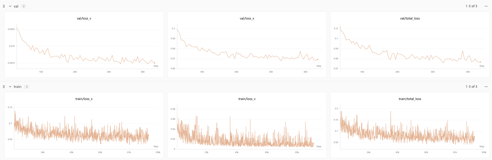

# 🎭 Seamless Avatar

A project for generating seamless dyadic interaction avatars.

## 🎬 Video Demo

> 🔊 **Note:** Click the speaker icon in the player to enable audio.

https://github.com/user-attachments/assets/5b7ac064-9d28-4e2c-b435-5aa6c7cd3457


## 🛠️ Environment Setup

Set up Hugging Face mirror for faster model downloads:

```bash
export HF_ENDPOINT=https://hf-mirror.com
```

### Installation Steps

```bash
# Create Conda environment
conda create -n seamless-avatar python=3.10
conda activate seamless-avatar

# Install system dependencies
apt-get update && apt-get install -y ffmpeg
apt-get install ninja-build

# Install Python dependencies
pip install git+https://github.com/NVlabs/nvdiffrast.git
pip install -r requirements.txt

# Set Hugging Face mirror again
export HF_ENDPOINT=https://hf-mirror.com
```

---

## 📁 Data Preparation

```bash
python -m src.data_preprocess.extract_tar_and_remove
python -m src.data_preprocess.compute_stats
python -m src.data_preprocess.generate_splits
```

---

## 🚀 Training

### Single GPU Training

```bash
python -m train_dit
```

### Multi-GPU Distributed Training

```bash
torchrun --nproc_per_node=6 -m train_dit
```


### 📉 Training Loss Curve ([Swanlab](https://swanlab.cn/))

DiT[Gesture] train loss curve on Swanlab:
[](https://swanlab.cn/@gjj/Seamless-Avatar/runs/6t4cimbag950wmqmwip44/chart)


click the following link to view the full training curve log:

- 👉  [DiT[Gesture]](https://swanlab.cn/@gjj/Seamless-Avatar/runs/6t4cimbag950wmqmwip44/chart)

- 👉  [DiT[Gesture]](https://swanlab.cn/@gjj/Seamless-Avatar/runs/6t4cimbag950wmqmwip44/chart)

- 👉  [DiT[Gesture]](https://swanlab.cn/@gjj/Seamless-Avatar/runs/6t4cimbag950wmqmwip44/chart)

---

## 🧪 Inference

```bash
python -m src.motion_detokenizer.infer_dit
```

---

## 📊 Metrics

```bash
python -m src.metrics.emage_metric
```

### Example Results

```
====================================================================================================
Summary Table
====================================================================================================
                                     FGD ↓     L1div ↑       LVD ↓       MSE ↓
----------------------------------------------------------------------------------------------------
DiT_holistic_pred_0108_v1         9.47e-01    5.63e+00    3.91e-05    1.24e-06
====================================================================================================
```

